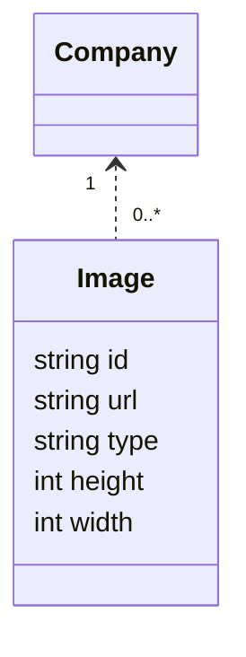

# Image

## Model

## Directory
- controller
- entry
- core
- behavior
- mock
- schema

## Enum
Nothing

## Mutation
- CreateImage(company Company, entry ImageEntry): Image { Image }

## Query
- GetImageById(id []string): []Image

## Property
- Image.url = s3やcloud storageのURL
- Image.type = image/jpeg, image/pngなどのMIMEタイプ

## Controller
- CreateImage  
  company = Company.GetCompanyByCode(entry)
  return Image.CreateImage(company, entry)
- GetImage  
  image = Image.GetImageById(entry)  
  company = Company.GetCompanyById(image.company_id)
  return Basic.Relate(image, company)

## Interface
- POST /company/{company_code}/image
  CreateImage  
- GET  /company/{company_code}/image/{image_code}
  GetImage  

## Note
- 本来は別システムでCompanyなどと同等の扱い
- ただ機能上あるとわかりやすいので、余裕があればCreateImageも実装する。
- GetImageは常に必要

