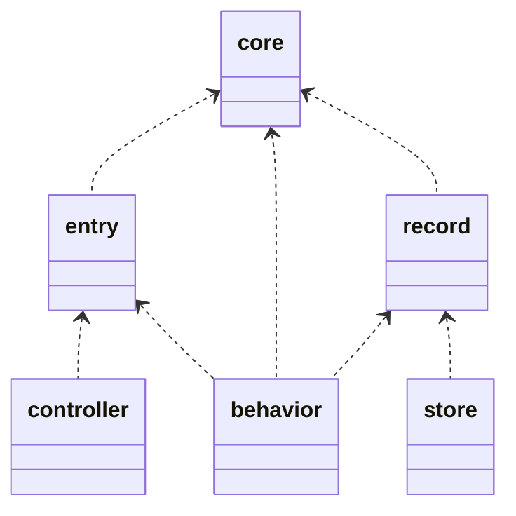

# Modules

モジュール構成についての解説。  
モデリング自体はaggregate.mdに記載しているが、それらをどう実装するのかについての指針を示す。

## 概要

ディレクトリの全体概要は以下の通り

- cmd
  - server
    - main.go
  - tool
    - main.go
- domain
  - route.go
  - command.go
  - ..EachAggregate
    - route.go
    - command.go
    - controller
    - entry
    - record
    - plain
    - behavior
    - mock
    - store
    - schema
- utility
  - controller

### utilityディレクトリについて
utilityディレクトリは、Aggregateを横断して利用する関数などを集める。
stringやdatabaseなどは後述するデフォルトAggregateに含まれる。そのほか単一の関心事項にフォーカスする関数などは適切なAggregate配下に配置する。
Aggregateを横断して利用するのは、主にcontroller層であるため、controllerディレクトリを用意している。独自middlewareなどもここに配置したい。

### route&commandファイルについて
route.goはwebのurl route定義、command.goはcliコマンド定義を行う。
各Aggregate配下に用意し、Aggregateごとのroute,commandを定義し、それを統括する定義をdomain直下に用意する。

### デフォルトAggregate構成
- database  
  データベース接続関連  
  
- local
  日付、乱数、ファイル、別プロセスの起動など、メモリとcpuの外に出る際の機能を提供する
- basic
  string,配列など組み込み型の拡張機能
- config
  環境変数取得、設定値管理など

## 各モジュールの役割

ディレクトリ上の各モジュールの役割は以下の通り

### valve  
アプリケーションの外に出る際の出口となる機能  
日付、乱数、ファイル、DB、外部API、別プロセスの起動など、メモリとcpuの外に出る際の機能を提供する  
特定のデータモデルに依存しない実装で、その上にデータモデルごとのインタフェースを用意するが、それはmodelディレクトリに置く  

### model  
特定のドメインモデルの集約を表現する  
集約単位でディレクトリを切り、その中に様々な実装を施す。詳細は別途記載  

controller,modelともに、集約ごとのディレクトリを切る。  
controllerは複数のmodelの集約を利用する形をとるが、利用のみのためディレクトリは細かくない。  
modelはIOを伴ったり、複数のデータモデルを扱うので、より細かく以下のようにディレクトリを切る。  

### データモデル系  
#### controller  
modelのふるまいを統合して、機能を提供する。アプリケーションのインタフェースとしての役割  
webであれば、routingに紐づける  
内部は集約の単位でディレクトリを切り、その中に各集約のcontrollerを配置する  
集約単位であるが、依存している集約のmodelも利用する  

#### record  
DBのレコードを表すのでDBと紐づけるselect句などの情報を持つ  
後述するentry,coreがない場合はこれのみなので、入力値設定も持つことになる  
またcoreがある場合は、coreへの変換ロジックも持つ  

#### entry  
入力値を表すのでwebからの入力json情報を持つ  
coreがある場合はcoreへ、ない場合はrecordへ変換するロジックを持つ  

#### core  
ビジネスロジックで扱う純粋なデータモデル。何にも依存しない  

#### schema  
アプリケーションではなく、DBのスキーマ定義  
マイグレーションなどで利用する  

### 処理実装系  
#### interface
behavior,storeのinterfaceを配置する  
ディレクトリではなく、トップレベルにファイルとして用意

#### behavior  
集約のふるまいとして関数を公開するが、その関数の実装を持つ  
storeがない場合は、valveを利用してsql定義などもするが簡易なもののみ  
storeがある場合はstoreを利用する  

#### store  
valveの機能を利用して、データの永続化、参照を行う  
主にsqlのwhere句を定義する  

#### mock  
behaviorもstoreも関数をまとめたオブジェクトを用意する
そのオブジェクトのinterfaceを実装したmockを配置

## 依存関係

各モジュールの依存関係は以下となる

## 実装順序

依存から検討される実装順序の指針

0. valve,utility,model/essenceの実装  
  使いまわせるので先に用意されているとよい
1. 各modelのinterface定義  
  a. coreがあればcore、なければrecordのデータ定義のみ  
  b. entryのデータ定義のみ  
  c. behavior interfaceとmock  
2. controllerの実装  
  modelのbehavior interfaceを利用するのみなのでこの段階で実装可能  
3. modelの実装  
  a. entry,core,recordでrecordがなければ定義。またお互いの変換ロジックも  
  b. storeの実装とmockの用意  
  c. behaviorの実装  
5. 統合テストの実装  

## model部品の分離基準

model部品は実装が簡単なら分離しない。そのほうが凝集度が高いので。
ただし、複雑になる場合は分離していくほうが、構造的に理解しやすい。
その基準を示していく。

### record
常に用意する。  

### entry
データモデルが他の集約から依存される場合、入力モデルと実際に依存されるモデルは分離しておきたい。  
また、保存しない情報、フラグが多い場合も用意したい。  

### core
アプリケーション上でロジックが複雑な場合に用意する。  
また、データモデルの項目にstringが多くて区別したい場合や、文字数、文字種などの制約の厳しいstringが複数存在する場合も用意したい。

### store
sqlが複雑になる場合に分離して用意する。  
単なるCRUDですむ場合、select文もjoinがない場合などは不要。  

### behavior
常に用意する。  

## その他
- modelが集約ごとに区切られているので、getな処理で複数の集約の関連するデータを取得する場合、controllerで複数のmodelを呼び出して合成する形になる。  
  その際に、各集約の紐づけは、依存する側が知っている必要がある。GraphQLのresolverみたいなイメージ。  
- 依存先のモデルは引数に注入される。しかしsqlの記載上は依存先のテーブルを参照して絞込を行う。ただし取得はしないので、集約境界を超えてデータを取得することはない  

